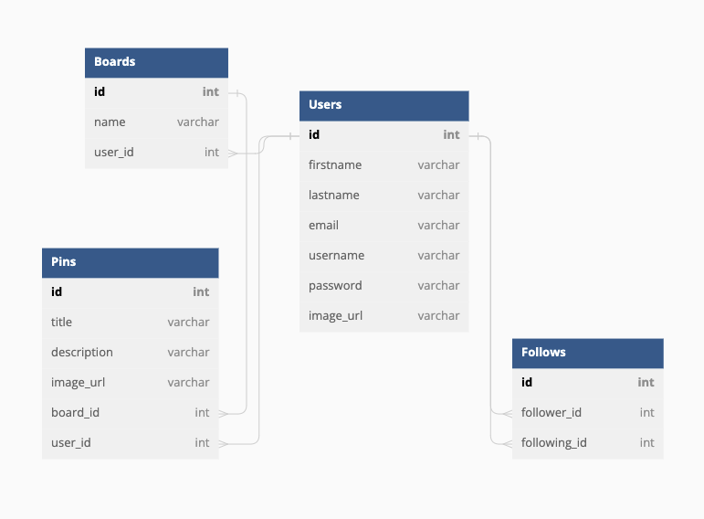

## Database Schema Design

# Backend Routes

## Product Listings

1.
--- Create a new pin
* Route/URL - "/pins"
* Method - POST
* Status code - 201

2.
--- Get all pins
* Route/URL - "/pins"
* Method - GET
* Status code - 200

3.
--- Get a pin by ID
* Route/URL - "/pins/:pinId"
* Method - GET
* Status code - 200

4.
--- Edit a pin by ID
* Route/URL - "/pins/:pinId/edit"
* Method - PUT
* Status code - 200

5.
--- Delete a product by ID
* Route/URL - "/pins/:pinId"
* Method - DELETE
* Status code - 200

6.
--- Create a new board
* Route/URL - "/boards"
* Method - POST
* Status code - 201

7.
--- Get a board by Id
* Route/URL - "/boards/:boardId"
* Method - GET
* Status code - 200

8.
--- Edit a board by Id
* Route/URL - "/boards/:boardId/edit"
* Method - PUT
* Status code - 200

9.
--- Delete a board by Id
* Route/URL - "/boards/:boardId"
* Method - DELETE
* Status code - 200

 ## Profile

 1.
--- Create a new user
* Route/URL - "/signup"
* Method - POST
* Status code - 201

2.
--- Edit a user profile
* Route/URL - "/users/:userId/edit"
* Method - PUT
* Status code - 200

3.
--- Delete a user profile
* Route/URL - "/users/:userId"
* Method - DELETE
* Status code - 200

4.
--- Get all pins from a user
* Route/URL - "/users/:userId"
* Method - GET
* Status code - 200

 ## Search
 1.
--- Get pin by name
* Route/URL - "/get/pins/?name"
* Parameters -
    + Pin names
* Method - GET
* Status code - 200

## Follow

1.
--- Get all follow 
* Route/URL - "/follows"
* Method - GET
* Status code - 200

2.
--- Add new follow
* Route/URL - "/follows"
* Method - POST
* Status code - 200

3. 
--- Delete follow
* Route/URL - "/follows/:followingId"
* Method - DELETE
* Status code - 200
